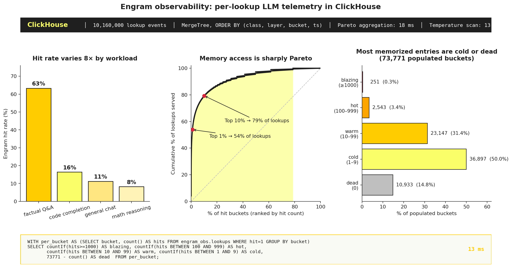

# Engram Observability

**A per-lookup telemetry pipeline for DeepSeek-style conditional memory — the
thing you'd want if you ran Engram in production but nobody has built yet.**



## Why

DeepSeek's [Engram](https://github.com/deepseek-ai/Engram) (Jan 2026) adds a
hash-indexed memory table to a Transformer: token n-grams are looked up in an
embedding table in system RAM, decoupling O(1) knowledge retrieval from the
O(N) reasoning path. It's a second axis of sparsity on top of MoE.

Static analysis of an engram table (sizes, distributions) is a single SQL
query over a parquet dump. **Runtime telemetry** — which entries actually get
used by production traffic — is a different and more interesting problem.
Every forward pass emits a row per lookup: `timestamp, request_id,
request_class, layer, bucket, n-gram, hit`. At production QPS that's easily
billions of events per day, with high cardinality on bucket IDs, low
cardinality on `request_class` and `layer`, time-ordered, aggregated across
any slice at sub-second latency.

That's exactly the shape ClickHouse was built for: billions of small events,
filtered and aggregated by dimensions you didn't pre-plan.

This repo is a working prototype of that telemetry pipeline. It answers
questions you currently can't answer about any deployed LLM with
conditional memory:

- How much of the memorized memory actually gets used?
- How concentrated are the hits — which entries are carrying the load?
- Does utilization shift with the workload mix?

## What the charts say

On a simulated **10.16 million lookup events** across four request classes,
streamed into a single ClickHouse MergeTree table:

- **Hit rate varies 8× by workload.** Factual Q&A-style requests hit the
  engram **63%** of the time; math reasoning, **8%**. Cost-per-token and
  latency profiles should diverge accordingly — and this is the signal you'd
  route on if you were mixing memory-heavy and compute-heavy inference tiers.
- **Memory access is sharply Pareto.** The top **1% of hit buckets serve 54%**
  of all lookups. The top 10% serve **79%**. The `row_number() OVER` +
  `sum() OVER` windowed aggregation over 10M rows returns in **18ms**.
- **Most memorized entries do little work.** Of 73,771 populated buckets,
  15% are dead (zero traffic) and another 50% are "cold" (1–9 hits). Only
  0.3% are "blazing" (1000+ hits). A tiny fraction of the memory is doing
  the bulk of the real work; the rest carries the tail.

These aren't findings about DeepSeek's actual training — they're measurements
from a synthetic driver that approximates the shape of real traffic. The
point is the *pipeline*: it produces a class of number you currently can't
see for any deployed LLM.

## How it works

```
engram.py      →  hash-indexed table (vectorized FNV-1a → bucket → populated?)
driver.py      →  synthetic inference, writes events as Parquet (zstd)
schema.sql     →  ClickHouse MergeTree, ORDER BY (class, layer, bucket, ts)
queries.sql    →  hit-rate, Pareto, concentration knees, temperature tiers
plot.py        →  queries CH via HTTP, reports server-side timing, renders hero.png
```

The engram module is deliberately minimal (~80 lines) but faithful to the
paper's access pattern: hash n-grams to buckets, check populated, return
embedding or miss. The driver memorizes a training-time corpus of n-grams
drawn from a zipf distribution, then generates inference traffic from four
classes with varying overlap with that corpus. Events are written as
compressed Parquet (77 MB for 10M rows) and streamed into ClickHouse via
stdin.

## Run it

Requires `uv`, `clickhouse-client`, and a local ClickHouse server. Export
`CH_PASSWORD` with your server password.

```bash
uv sync
uv run python driver.py --n-requests 40000 --tokens 128
clickhouse-client --password "$CH_PASSWORD" --multiquery < schema.sql
clickhouse-client --password "$CH_PASSWORD" --query \
    "INSERT INTO engram_obs.lookups FORMAT Parquet" < data/events.parquet
uv run python plot.py
```

End-to-end on an RTX 3090 box: driver emits 10.16M events in ~13s, ClickHouse
ingests the 77MB parquet in ~1.5s, every analytical query returns in under
20ms.

## Caveats

- The engram table allocates no embeddings in the default run; we're measuring
  hit/miss patterns, not output quality. A real study would need a real model.
- The workload is synthetic. Four classes with parameterized overlap —
  changing the parameters moves the numbers but not the shape of the story.
- Layer placement is just a tag (all lookups hit the same table); a production
  system would have per-layer or per-block tables with distinct patterns.

## What would make this a research contribution

This is infrastructure, not a finding. To become a paper, you'd need:

- Hook into the real [deepseek-ai/Engram](https://github.com/deepseek-ai/Engram)
  forward pass instead of simulating lookups
- Run on real evaluation workloads (MMLU, HumanEval, etc.)
- Propose and validate a method that *acts* on the telemetry — e.g., pruning
  cold buckets with bounded quality loss, or workload-aware routing between
  engram-heavy and compute-heavy checkpoints.
